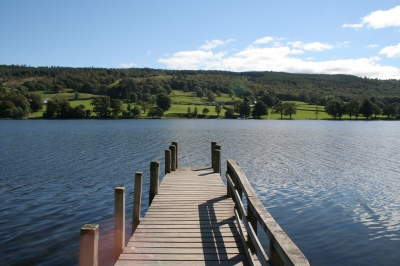

# Coast2Coast walk
## Source: TeamSpirit
### Date: Feb 2014

This summer we’re organising a 188 mile trek along Alfred Wainwright’s acclaimed route, inspired by a group of Australian supporters who are journeying to the UK to complete the epic walk.

Taking place from 30th August to 11th September, the route runs from the Irish Sea to the North Sea.
With two-thirds of the route set within the Lake District, Yorkshire Dales and North York Moors National Parks, this is an opportunity to enjoy one of England’s most magnificent treks.

The walk starts at St Bees in Cumbria, with highlights including the many lakes, valleys and peaks of the Lake District, the remote moorland of the Yorkshire Dales and the extraordinary views from the Beacon Hills, before finally ending at the dramatic cliff side setting of Robin Hood’s Bay.

To sign up just visit our website, or contact the fundraising team at elise.murray@mssociety.org.uk